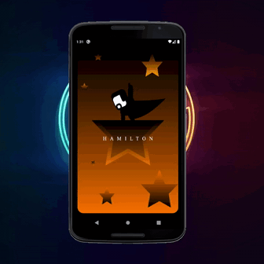

<p align="center">
  <a href="https://github.com/Singh-Shivani/Hamilton_Flare">
     
  </a>
</p>

<p align ="center"> 
<i>A simple graphic animation using <a href="https://rive.app/">Rive 😍</a>  in <a href="https://flutter.dev/">Flutter 💕</a> </i>
<br>

### What's Rive? 🤔

  - A real time interactive design tool that allows you to design, animate and immediately 🤩 integrate your amazing designs to your desired end product.
  - It allows designers to make any design, animation, icons, character and so many things. These are real design assests that run in real time in your app or game.🔥
  - An Open Source Platform🖤
  
  
### What about Flare? 👀

  - Flare offers powerful realtime vector design and animation for app and game designers alike.🤓
  - The primary goal of Flare is to allow designers to work directly with assets that run in their final product, eliminating the need to redo that work in code.🦾
  
  
### Installation ⚙️
 To run this animation in flutter you'll require ```flare_flutter```
   1. Depend on it
   ```sh
   dependencies:
     flare_flutter: ^2.0.5
```
  
  2. Import it
  ```sh
  import 'package:flare_flutter/flare_actor.dart';
``` 

  3. Make a new folder name ```assets``` in the  ```project-level``` directory.
  
  
  4. Add your flare file(.flr) into that assets folder.

  
  5. Update your ``` pubspec.yaml``` file
  
     Add this line into your pubspec.yaml file(don't forget to change this file name as your file name, make sure your indentation is proper.)
     ```sh
     assets:
     - assets/Hamilton.flr
     ```
  
    

  <p align="center">
     
</p>
